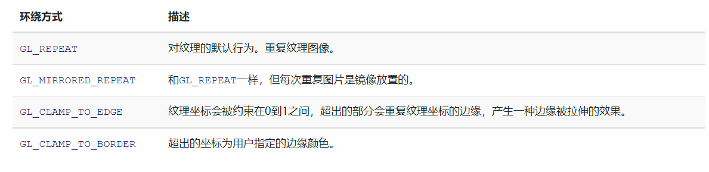
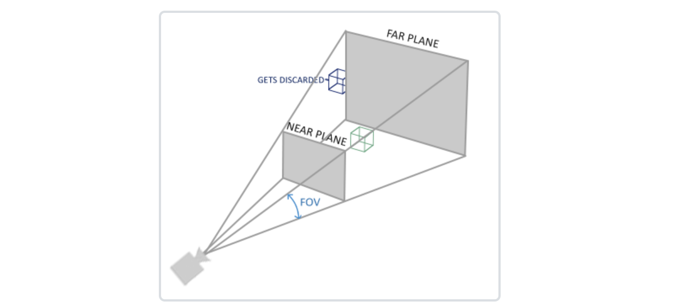

# LearnOpenGL

## 一，入门

### 1.OpenGL

- OpenGL：一个定义了函数布局和输出的图形API的正式规范。

- 可分为两种模式

  1.立即渲染模式（固定渲染管线）

  2.核心模式（可编程，可配置）
  
- OpenGL是一个**状态机**：一系列的变量描述OpenGL此刻应当如何运行。
  
  如何修改状态？
  
  1. 设置选项
  2. 操作缓冲

- 状态设置函数：改变上下文。
  
  状态使用函数：执行操作。
  
- OpenGL对象是openGL**状态**的一个**子集**
  
    ~~~c
    // OpenGL的状态
    struct OpenGL_Context {
        ...
        object* object_Window_Target;
        ...     
    };
    ~~~
  ~~~c
  // 创建对象
  unsigned int objectId = 0;
  glGenObject(1, &objectId);
  // 绑定对象至上下文
  glBindObject(GL_WINDOW_TARGET, objectId);
  // 设置当前绑定到 GL_WINDOW_TARGET 的对象的一些选项
  glSetObjectOption(GL_WINDOW_TARGET, GL_OPTION_WINDOW_WIDTH, 800);
  glSetObjectOption(GL_WINDOW_TARGET, GL_OPTION_WINDOW_HEIGHT, 600);
  // 将上下文对象设回默认
  glBindObject(GL_WINDOW_TARGET, 0);
  ~~~

​		结果：设置的选项保存在objectId所引用的对象中，下次只需要调用glBindObject函数重新绑定，相关设置就会生效。

​		好处：可以设置多个对象的选项，执行使用OpenGL状态的操作时，不仅不用重新设置选项，还可以自由切换。

### 2.创建窗口

- GLFW：一个专门针对OpenGL的C语言库，它提供了一些渲染物体所需的最低限度的接口。

- GLAD：OpenGL具体的实现是由驱动开发商针对特定显卡实现的，它大多数函数的位置都无法在编译时确定下来，需要在运行时查询，并保存在一个个函数指针中，GLAD用来为我们加载并设定所有OpenGL函数指针。

### 3.你好，窗口

- 回调函数：通过函数指针调用的函数。

  - 过程：把函数的地址作为参数传递给另一个函数，之后用该函数指针调用其所指向的函数。

  - 意义：不同层函数间的解耦。

    库函数（不可见，不可修改）

    主函数，回调函数（可见，可修改）

  ​       过程： 自定义回调函数并将其地址传递给库函数，就可以在不修改库函数的情况下，实现不同的功能。

  ​	   例：事件系统。
  
### 4.你好，三角形

1. 顶点数组对象：Vertex Array Object，VAO
2. 顶点缓冲对象：Vertex Buffer Object，VBO
3. 索引缓冲对象：Element Buffer Object，EBO

图形渲染管线

- 原始图形数据途径一个输送管道，经过各种变化输出在屏幕上。
- 3D坐标======>2D坐标（精确，不受分辨率限制）====***采样离散化***===>实际像素（不精确，受分辨率限制）       

>顶点数据
>>顶点1
>>顶点2
>>顶点3
>>
>>>顶点属性1
>>>顶点属性2
>>>顶点属性3

1. 顶点着色器：**把3D坐标转为另一种3D坐标**，同时对顶点属性进行一些基本处理。
2. 图元装配：将顶点着色器输出的所有顶点作为输入，并把所有的点**装配成指定图元的形状**。
3. 几何着色器：把图元形式的一系列顶点的集合作为输入，通过**产生新顶点**构造出新的（或是其它的）图元来生成其他形状。
4. 光栅化：它会把**图元映射为**最终屏幕上相应的**像素**，生成供片段着色器(Fragment Shader)使用的片段(Fragment)。在片段着色器运行之前会执行**裁切**(Clipping)。裁切会丢弃超出你的视图以外的所有像素，用来提升执行效率。
5. 片段着色器：主要目的是计算一个像素的最终颜色。
6. Alpha测试和混合测试：这个阶段检测片段的对应的深度（和模板(Stencil)）值，用它们来**判断这个像素是其它物体的前面还是后面**，决定是否应该丢弃。这个阶段也会检查alpha值（alpha值定义了一个物体的透明度）并对物体进行混合(Blend)。

- 现代OpenGL中，**至少**定义一个顶点着色器和片段着色器。

- VBO管理着GPU上的一块内存，其中存储着大量顶点数据。

  好处：可以一次性的发送一大批数据到显卡上（减少DrawCall次数）；顶点着色器是运行在GPU上的程序，能够立即访问显存上的顶点数据。

  ~~~c
   // 创建VBO
   unsigned int VBO;
   glGenBuffers(1, &VBO);
   
   glBindBuffer(GL_ARRAY_BUFFER, VBO);  //绑定顶点缓冲对象
   
   glBufferData(GL_ARRAY_BUFFER, sizeof(vertices), vertices, GL_STATIC_DRAW);//把CPU内存中顶点数据复制到GPU内存中;第四个参数指定了我们希望显卡如何管理给定的数据
  ~~~

  - GL_STATIC_DRAW ：数据不会或几乎不会改变。

  - GL_DYNAMIC_DRAW：数据会被改变很多。

  - GL_STREAM_DRAW ：数据每次绘制时都会改变。

    注：一个缓冲中的数据将频繁被改变，那么使用的类型就是GL_DYNAMIC_DRAW或GL_STREAM_DRAW，这样就能确保显卡把数据放在能够高速写入的内存部分。

- 顶点着色器（用着色器语言GLSL编写）

  ~~~glsl
  #version 330 core//版本声明
  layout (location = 0) in vec3 aPos;
  
  void main()
  {
      gl_Position = vec4(aPos.x, aPos.y, aPos.z, 1.0);
  }
  ~~~
  - in：关键字，声明所有的输入顶点属性。
  - layout（location=0）：设定了输入变量的位置值（与VAO中设定的位置值对应）
  - gl_Position：预定义的vec4类型（默认输出到下一个着色器）
  ~~~glsl
  unsigned int vertexShader;
  vertexShader = glCreateShader(GL_VERTEX_SHADER);//创建着色器
  
  glShaderSource(vertexShader, 1, &vertexShaderSource, NULL);
  glCompileShader(vertexShader);//绑定源码字符串，并编译
  
  int  success;
  char infoLog[512];
  glGetShaderiv(vertexShader, GL_COMPILE_STATUS, &success);
  
  if(!success)
  {
      glGetShaderInfoLog(vertexShader, 512, NULL, infoLog);
      std::cout << "ERROR::SHADER::VERTEX::COMPILATION_FAILED\n" <<           infoLog << std::endl;
  }//判断是否编译成功，并输出错误信息
  ~~~
  
- 片段着色器：计算像素最后的颜色输出。

  ~~~glsl
  #version 330 core
  out vec4 FragColor;//声明输出变量
  
  void main()
  {
      FragColor = vec4(1.0f, 0.5f, 0.2f, 1.0f);
  } 
  ~~~

- 着色器程序：合并链接各个着色器，每个着色器的输出链接到下个着色器的输入，当输出和输入不匹配时，会报连接错误。
  ~~~c
  unsigned int shaderProgram;
  shaderProgram = glCreateProgram();
  
  glAttachShader(shaderProgram, vertexShader);
  glAttachShader(shaderProgram, fragmentShader);
  glLinkProgram(shaderProgram);
  ~~~
  
- 链接顶点属性：指定OpenGL该如何解释顶点数据。

  
  ~~~c
  glVertexAttribPointer(0, 3, GL_FLOAT, GL_FALSE, 3 * sizeof(float),(void*)0);
  glEnableVertexAttribArray(0);//是否启用顶点属性，默认为关。
  ~~~
  
  1. 第一个参数：指定我们要配置的顶点属性的位置值（对应着layout（location=？））。
  2. 第二个参数：指定顶点属性的大小。
  3. 第三个参数：指定数据的类型。
  4. 第四个参数：是否希望数据被标准化(Normalize)。
  5. 第五个参数：步长(Stride)，它告诉我们在连续的顶点属性组之间的间隔（单位是字节）。
  6. 最后一个参数：表示位置数据在缓冲中起始位置的偏移量（单位是字节）。
  
- 在OpenGL中绘制一个物体

  ~~~c
  // 0. 复制顶点数组到缓冲中供OpenGL使用
  glBindBuffer(GL_ARRAY_BUFFER, VBO);
  glBufferData(GL_ARRAY_BUFFER, sizeof(vertices), vertices, GL_STATIC_DRAW);
  // 1. 设置顶点属性指针
  glVertexAttribPointer(0, 3, GL_FLOAT, GL_FALSE, 3 * sizeof(float), (void*)0);
  glEnableVertexAttribArray(0);
  // 2. 当我们渲染一个物体时要使用着色器程序
  glUseProgram(shaderProgram);
  // 3. 绘制物体
  someOpenGLFunctionThatDrawsOurTriangle();
  ~~~

- 顶点数组对象VAO：将各个顶点属性的配置保存在由VAO所引用的对象数组中，只需配置一次，绘制前绑定即可。

  
  ~~~c
  unsigned int VAO;
  glGenVertexArrays(1, &VAO);
  
  // 1. 绑定VAO
  glBindVertexArray(VAO);
  // 2. 把顶点数组复制到缓冲中供OpenGL使用
  glBindBuffer(GL_ARRAY_BUFFER, VBO);
  glBufferData(GL_ARRAY_BUFFER, sizeof(vertices), vertices,        GL_STATIC_DRAW);
  // 3. 设置顶点属性指针
  glVertexAttribPointer(0, 3, GL_FLOAT, GL_FALSE, 3 * sizeof(float),                            (void*)0);
  glEnableVertexAttribArray(0);
  ...
  // 4. 绘制物体
  glUseProgram(shaderProgram);
  glBindVertexArray(VAO);//渲染前绑定即可
  someOpenGLFunctionThatDrawsOurTriangle();
  
  ~~~

- 最终绘制

  ~~~c
  glUseProgram(shaderProgram);
  glBindVertexArray(VAO);
  glDrawArrays(GL_TRIANGLES, 0, 3);//0：起始索引；3：绘制顶点数
  ~~~
  
- 索引缓冲对象：显存上的缓冲，专门存储索引，决定按什么顺序绘制顶点。

  ~~~c
  float vertices[] = {
    0.5f, 0.5f, 0.0f,   // 右上角
    0.5f, -0.5f, 0.0f,  // 右下角
    -0.5f, -0.5f, 0.0f, // 左下角
    -0.5f, 0.5f, 0.0f   // 左上角
  };
  
  unsigned int indices[] = { // 注意索引从0开始! 
    0, 1, 3, // 第一个三角形
    1, 2, 3  // 第二个三角形
  };//设置绘制顺序
  
  unsigned int EBO;
  glGenBuffers(1, &EBO);
  
  glBindBuffer(GL_ELEMENT_ARRAY_BUFFER, EBO);
  glBufferData(GL_ELEMENT_ARRAY_BUFFER, sizeof(indices), indices,     GL_STATIC_DRAW);
  
  glBindBuffer(GL_ELEMENT_ARRAY_BUFFER, EBO);
  glDrawElements(GL_TRIANGLES, 6, GL_UNSIGNED_INT, 0);
  //用glDrawElements来替换glDrawArrays
  //6：顶点数量； GL_UNSIGNED_INT:索引类型；0：偏移量
  ~~~

  - VAO绑定时正在绑定的索引缓冲对象会被保存为VAO的元素缓冲对象。绑定VAO的同时也会自动绑定EBO
    

- 最终代码

  ~~~c
  // 1. 绑定顶点数组对象
  glBindVertexArray(VAO);
  // 2. 把我们的顶点数组复制到一个顶点缓冲中，供OpenGL使用
  glBindBuffer(GL_ARRAY_BUFFER, VBO);
  glBufferData(GL_ARRAY_BUFFER, sizeof(vertices), vertices,      GL_STATIC_DRAW);
  // 3. 复制我们的索引数组到一个索引缓冲中，供OpenGL使用
  glBindBuffer(GL_ELEMENT_ARRAY_BUFFER, EBO);
  glBufferData(GL_ELEMENT_ARRAY_BUFFER, sizeof(indices), indices,  GL_STATIC_DRAW);
  // 4. 设定顶点属性指针
  glVertexAttribPointer(0, 3, GL_FLOAT, GL_FALSE, 3 * sizeof(float),   (void*)0);
  glEnableVertexAttribArray(0);
  
      ...
  
  //绘制代码（渲染循环中） 
  glUseProgram(shaderProgram);
  glBindVertexArray(VAO);
  glDrawElements(GL_TRIANGLES, 6, GL_UNSIGNED_INT, 0)
  glBindVertexArray(0);
  ~~~

### 5.着色器

- 着色器是**独立**的小程序，GLSL定义了in和out关键字专门来进行数据交流和传递（即设定输入和输出），只要一个输出变量与下一个着色器阶段的输入**匹配**，它就会传递下去。

- 顶点着色器的输入特殊在它**从顶点数据中直接接收输入**。

- 发送方着色器中声明一个输出，在接收方着色器中声明一个类似的输入。当**类型和名字**都一样的时候，OpenGL就会把两个变量链接到一起，它们之间就能发送数据了。

- Uniform是一种从CPU中的应用向GPU中的着色器发送数据的方式；uniform是全局的，在每个着色器程序对象中都是独一无二的，而且它可以被着色器程序的**任意着色器在任意阶段访问**。

  ~~~glsl
  #version 330 core
  out vec4 FragColor;
  
  uniform vec4 ourColor; // 在OpenGL程序代码中设定这个变量
  
  void main()
  {
      FragColor = ourColor;
  }
  ~~~

  uniform应用实例（随着时间改变颜色）

  ~~~glsl
  float timeValue = glfwGetTime();//获得运行秒数
  float greenValue = (sin(timeValue) / 2.0f) + 0.5f;
  int vertexColorLocation = glGetUniformLocation(shaderProgram, "ourColor");//查询uniform变量的位置
  glUseProgram(shaderProgram);
  glUniform4f(vertexColorLocation, 0.0f, greenValue, 0.0f, 1.0f);//设置uniform变量的值
  ~~~
- 片段插值:渲染一个三角形时，光栅化阶段通常会生成比原指定顶点更多的片段。光栅会根据每个片段在三角形上所处**相对位置**决定这些片段的位置。基于这些位置，它会插值所有片段着色器的输入变量。

### 6.纹理

- 为了能够把纹理映射到三角形上，我们需要指定三角形的每个顶点各自对应纹理的哪个部分。这样每个顶点就会关联着一个纹理坐标(2D)，用来标明该从纹理图像的哪个部分采样，之后在图形的其它片段上进行片段插值，获取各个片段的纹理坐标。
- **纹理环绕方式**：纹理坐标的范围通常是从(0, 0)到(1, 1)，若超出范围，OpenGL默认会重复这个纹理图像，同时也有其他环绕方式。

​      

~~~c
glTexParameteri(GL_TEXTURE_2D, GL_TEXTURE_WRAP_S, GL_MIRRORED_REPEAT);
glTexParameteri(GL_TEXTURE_2D, GL_TEXTURE_WRAP_T, GL_MIRRORED_REPEAT);

float borderColor[] = { 1.0f, 1.0f, 0.0f, 1.0f };
glTexParameterfv(GL_TEXTURE_2D, GL_TEXTURE_BORDER_COLOR, borderColor);
~~~
- **纹理过滤**：纹理坐标不依赖于分辨率，可以是任意浮点值，纹理像素并不能一一映射到纹理坐标上，需要纹理过滤来确定纹理坐标对应的像素颜色。
  
  - 邻近过滤（GL_NEAREST）：选择中心点最接近纹理坐标的那个像素。
  - 线性过滤（GL_LINEAR）：基于纹理坐标附近的纹理像素，计算插值。
  ~~~c
  glTexParameteri(GL_TEXTURE_2D, GL_TEXTURE_MIN_FILTER, GL_NEAREST);
  glTexParameteri(GL_TEXTURE_2D, GL_TEXTURE_MAG_FILTER, GL_LINEAR);
  ~~~

​		注：可以在纹理被缩小的时候使用邻近过滤，被放大时使用线性过滤。

- **多级渐远纹理**：根据高分辨率的纹理图像，生成一系列的纹理图像，后一个纹理图像的分辨率是前一个的二分之一，再根据观察的距离应用不同的纹理图像。

  正如纹理像素并不能一一映射到纹理坐标上，多级渐远纹理层也不能一一对应到不同距离的物体上，所以  	也需要过滤，而且可 以和纹理过滤一起设置。

~~~c
//纹理缩小
glTexParameteri(GL_TEXTURE_2D, GL_TEXTURE_MIN_FILTER, GL_LINEAR_MIPMAP_LINEAR);
//纹理放大
glTexParameteri(GL_TEXTURE_2D, GL_TEXTURE_MAG_FILTER, GL_LINEAR);
~~~

**注意**：纹理放大不会使用多级渐远纹理。

- 加载与创建纹理

  - 运用stb_image库加载图片

  ~~~
  int width, height, nrChannels;
  unsigned char *data = stbi_load("container.jpg", &width, &height,   &nrChannels, 0);
  ~~~

  - 生成纹理

  ~~~c
  unsigned int texture;
  glGenTextures(1, &texture);
  glBindTexture(GL_TEXTURE_2D, texture);
  
  glTexImage2D(GL_TEXTURE_2D, 0, GL_RGB, width, height, 0, GL_RGB,   GL_UNSIGNED_BYTE, data);
  glGenerateMipmap(GL_TEXTURE_2D);
  ~~~

  - glTexImage2D参数说明：

  1.第一个参数指定了纹理目标。
  2.第二个参数为纹理指定多级渐远纹理的级别（0是基本级别）。
  3.第三个参数告诉OpenGL把纹理储存为何种格式。
  4.第四个和第五个参数设置最终的纹理的宽度和高度。
  5.下个参数应该总是被设为0（历史遗留问题）。
  6.第七第八个参数定义了源图的格式和数据类型。
  7.最后一个参数是真正的图像数据。

  注：生成了纹理和相应的多级渐远纹理后可以释放图像的内存

  ~~~c
  stbi_image_free(data);
  ~~~

总体代码：

~~~c
unsigned int texture;
glGenTextures(1, &texture);
glBindTexture(GL_TEXTURE_2D, texture);
// 为当前绑定的纹理对象设置环绕、过滤方式
glTexParameteri(GL_TEXTURE_2D, GL_TEXTURE_WRAP_S, GL_REPEAT);   
glTexParameteri(GL_TEXTURE_2D, GL_TEXTURE_WRAP_T, GL_REPEAT);
glTexParameteri(GL_TEXTURE_2D, GL_TEXTURE_MIN_FILTER, GL_LINEAR);
glTexParameteri(GL_TEXTURE_2D, GL_TEXTURE_MAG_FILTER, GL_LINEAR);
// 加载并生成纹理
int width, height, nrChannels;
unsigned char *data = stbi_load("container.jpg", &width, &height, &nrChannels, 0);
if (data)
{
    glTexImage2D(GL_TEXTURE_2D, 0, GL_RGB, width, height, 0, GL_RGB, GL_UNSIGNED_BYTE, data);
    glGenerateMipmap(GL_TEXTURE_2D);
}
else
{
    std::cout << "Failed to load texture" << std::endl;
}
stbi_image_free(data);
~~~

- 应用纹理

  1. 更新顶点数据
  
     ~~~c
     float vertices[] = {
     //     ---- 位置 ----       ---- 颜色 ----     - 纹理坐标 -
     0.5f,  0.5f, 0.0f,   1.0f, 0.0f, 0.0f,   1.0f, 1.0f,   // 右上
     0.5f, -0.5f, 0.0f,   0.0f, 1.0f, 0.0f,   1.0f, 0.0f,   // 右下
      -0.5f, -0.5f, 0.0f,   0.0f, 0.0f, 1.0f,   0.0f, 0.0f,   // 左下
      -0.5f,  0.5f, 0.0f,   1.0f, 1.0f, 0.0f,   0.0f, 1.0f    // 左上
     };
     ~~~
     
    2. 添加顶点属性
  
       ~~~c
       glVertexAttribPointer(2, 2, GL_FLOAT, GL_FALSE, 8 *  sizeof(float), (void*)(6 * sizeof(float)));
       glEnableVertexAttribArray(2);
       ~~~
       
       
       
     3. 修改顶点着色器（读取并输出纹理坐标）
  
        ~~~c
        #version 330 core
        layout (location = 0) in vec3 aPos;
        layout (location = 1) in vec3 aColor;
        layout (location = 2) in vec2 aTexCoord;
        
        out vec3 ourColor;
        out vec2 TexCoord;
        
        void main()
        {
            gl_Position = vec4(aPos, 1.0);
            ourColor = aColor;
            TexCoord = aTexCoord;
        }
        ~~~
       
     4. 修改片段着色器(接收纹理坐标获得纹理对象)
  
        ~~~c
        #version 330 core
        out vec4 FragColor;
        
        in vec3 ourColor;
        in vec2 TexCoord;
        
        uniform sampler2D ourTexture;
        
        void main()
        {
            FragColor = texture(ourTexture, TexCoord);
        }
        ~~~
        
     5. 绑定纹理并开始绘制。
  
        ~~~
        glBindTexture(GL_TEXTURE_2D, texture);
        glBindVertexArray(VAO);
        glDrawElements(GL_TRIANGLES, 6, GL_UNSIGNED_INT, 0);
        ~~~

  

- 纹理单元

  使用glUniform1i函数可以给纹理采样器分配一个位置值，可以在一个片段着色器中设置多个纹理，一个纹理的位置值通常称为一个纹理单元(Texture Unit)。

好处：可以一次绑定多个纹理，只要用glActiveTexture激活对应的纹理单元，再绑定。

~~~c
glActiveTexture(GL_TEXTURE0); // 在绑定纹理之前先激活纹理单元
glBindTexture(GL_TEXTURE_2D, texture);
~~~

多纹理着色器的修改：

~~~c
#version 330 core
...

uniform sampler2D texture1;
uniform sampler2D texture2;

void main()
{
    FragColor = mix(texture(texture1, TexCoord), texture(texture2, TexCoord), 0.2);
    //mix用来混合两个纹理，0.2表示第二个纹理值的占比。
}
~~~

需要额外添加的渲染流程：

~~~c
glActiveTexture(GL_TEXTURE0);
glBindTexture(GL_TEXTURE_2D, texture1);
glActiveTexture(GL_TEXTURE1);
glBindTexture(GL_TEXTURE_2D, texture2);

glBindVertexArray(VAO);
glDrawElements(GL_TRIANGLES, 6, GL_UNSIGNED_INT, 0);

ourShader.use(); // 不要忘记在设置uniform变量之前激活着色器程序！
glUniform1i(glGetUniformLocation(ourShader.ID, "texture1"), 0); // 手动设置
ourShader.setInt("texture2", 1); // 或者使用着色器类设置

while(...) 
{
    [...]
}
~~~

### 7.变换

- 叉乘：叉乘只在3D空间中有定义，它需要两个不平行向量作为输入，生成一个正交于两个输入向量的第三个向量。
- 避免万向节死锁的真正解决方案是使用四元数(Quaternion)，它不仅更安全，而且计算会更有效率。

1.  创建变换矩阵

   ~~~c
   glm::mat4 trans;
	trans = glm::translate(trans, glm::vec3(0.5f, -0.5f, 0.0f));
	trans = glm::rotate(trans, (float)glfwGetTime(), glm::vec3(0.0f,0.0f, 1.0f));
   ~~~

2. 查询uniform变量地址并使用glUniform发送数据给着色器。

   ~~~c
   unsigned int transformLoc = glGetUniformLocation(ourShader.ID, 	"transform");
   glUniformMatrix4fv(transformLoc, 1, GL_FALSE, glm::value_ptr(trans));
   ~~~

### 8.坐标系统

1.局部坐标：局部空间是指物体本身的坐标空间，可表示物体顶点之间的相对位置。

2.世界坐标：利用模型矩阵将物体的局部坐标转化为世界坐标，可表示不同物体（顶点）间的相对位置。

3.观察坐标：利用观察矩阵将世界空间坐标转化为用户视野前方的坐标而产生的结果。

4.裁剪坐标：投影矩阵将指定的范围内的坐标变换为标准化设备坐标的范围，范围外的点会被裁剪掉。

注：如果只是图元(Primitive)，例如三角形，的一部分超出了裁剪体积(Clipping Volume)，则OpenGL会重新构建这个三角形为一个或多个三角形让其能够适合这个裁剪范围。

- 正射投影：平截头体由宽、高、近(Near)平面和远(Far)平面所指定，顶点坐标的w值保持不变（1.0）

  

  ~~~c
  glm::ortho(0.0f, 800.0f, 0.0f, 600.0f, 0.1f, 100.0f);
  ~~~

- 透视投影：投影矩阵将给定的平截头体范围映射到裁剪空间，除此之外还修改了每个顶点坐标的w值，从而使得离观察者越远的顶点坐标w分量越大。

  

~~~c
glm::mat4 proj = glm::perspective(glm::radians(45.0f), (float)width/(float)height, 0.1f, 100.0f);
~~~

OpenGL要求所有可见的坐标都落在-1.0到1.0范围内，作为顶点着色器最后的输出，一旦坐标在裁剪空间内，透视除法就会被应用到裁剪空间坐标上：

- 变换组合

  

- 最后，OpenGL会使用glViewPort内部的参数来将标准化设备坐标映射到**屏幕坐标**，每个坐标都关联了一个屏幕上的点。这个过程称为视口变换。

- Z-Buffer:深度值存储在每个片段里面（即z值），当片段想要输出它的颜色时，OpenGL会将它的深度值和Z-Buffer进行比较，若当前z值小于缓冲区的深度值（片段被挡住），它将会被丢弃，否则将会覆盖，这个过程称为深度测试(Depth Testing)。

  ~~~c
  glEnable(GL_DEPTH_TEST);
  glClear(GL_COLOR_BUFFER_BIT | GL_DEPTH_BUFFER_BIT);
  ~~~

### 9.摄像机

- 观察矩阵把所有的世界坐标变换为相对于摄像机位置与方向的观察坐标。要定义一个摄像机，我们需要它在世界空间中的位置、观察的方向、一个指向它右侧的向量以及一个指向它上方的向量。

  

- 摄像机位置

   ~~~c
   glm::vec3 cameraPos = glm::vec3(0.0f, 0.0f, 3.0f);
   ~~~

- 摄像机方向

   ~~~c
   glm::vec3 cameraTarget = glm::vec3(0.0f, 0.0f, 0.0f);
   glm::vec3 cameraDirection = glm::normalize(cameraPos - cameraTarget);
   ~~~

    注：方向向量指向摄像机z轴正方向，与摄像机实际指向方向相反。

- 右轴

   先定义一个上向量，接下来把上向量和第二步得到的方向向量进行叉乘得到右向量。

   ~~~c
   glm::vec3 up = glm::vec3(0.0f, 1.0f, 0.0f); 
   glm::vec3 cameraRight = glm::normalize(glm::cross(up,  cameraDirection));
   ~~~

- 上轴

   ~~~c
   glm::vec3 cameraUp = glm::cross(cameraDirection, cameraRight);
   ~~~

- Look At矩阵

  

  R是右向量，U是上向量，D是方向向量，P是摄像机位置向量。
  
  ~~~c
  glm::mat4 view;
  view = glm::lookAt(glm::vec3(0.0f, 0.0f, 3.0f), //位置
         glm::vec3(0.0f, 0.0f, 0.0f), //摄像机看向的目标
         glm::vec3(0.0f, 1.0f, 0.0f));//上向量
  ~~~

- 鼠标输入

  1. 声明回调函数

     ~~~c
     void mouse_callback(GLFWwindow* window, double xpos, double ypos);
     ~~~
     
   2. 在GLFW注册回调函数（GLFW会监听鼠标移动事件，鼠标一移动mouse_callback函数就会被调用）
  
      ~~~c
      glfwSetCursorPosCallback(window, mouse_callback);
      ~~~
      
   3. 实现回调函数
  
      ~~~c
      void mouse_callback(GLFWwindow* window, double xpos, double ypos)
      {
        if(firstMouse)
        {
          lastX = xpos;
          lastY = ypos;
          firstMouse = false;
        }
      
        float xoffset = xpos - lastX;
        float yoffset = lastY - ypos; 
        lastX = xpos;
        lastY = ypos;
      
        float sensitivity = 0.05;
        xoffset *= sensitivity;
        yoffset *= sensitivity;
      
        yaw   += xoffset;
        pitch += yoffset;
      
        if(pitch > 89.0f)
            pitch = 89.0f;
        if(pitch < -89.0f)
            pitch = -89.0f;
      
        glm::vec3 front;
        front.x = cos(glm::radians(yaw)) * cos(glm::radians(pitch));
        front.y = sin(glm::radians(pitch));
        front.z = sin(glm::radians(yaw)) * cos(glm::radians(pitch));
        cameront = glm::normalize(front);
  	}
      ~~~
  

## 二，光照

### 1.颜色

### 2.基础光照

- 冯氏光照模型（主要结构由3个分量组成：环境(Ambient)、漫反射(Diffuse)和镜面(Specular)光照）

1. 环境光照：即使在没有光直接照射的情况下，该物体也几乎不可能是完全黑的。
2. 漫反射光照：模拟光源对物体的方向性影响。物体的某一部分越是正对着光源，它就会越亮。
3. 镜面光照：模拟有光泽物体上面出现的亮点。镜面光照的颜色相比于物体的颜色会更倾向于光的颜色。

- 处理间接光

  1. 全局光照算法 优：比较准确；劣：复杂且开销高。
  2. 环境光照 :简化的光照模型。

  片段着色器代码：

  ~~~glsl
  void main()
  {
    float ambientStrength = 0.1;
    vec3 ambient = ambientStrength * lightColor;
  
    vec3 result = ambient * objectColor;
    FragColor = vec4(result, 1.0);
  }
  ~~~

- 漫反射光照

  原理：漫反射光照使物体上与光线方向越接近的片段能从光源处获得更多的亮度。

  

- 法向量

  1. 使用叉乘，利用它周围的顶点来计算出这个顶点的法线（即切面的法线）。
  
  2. 简单地把法线数据手工添加到顶点数据中。
  
- 计算漫反射光照

  1. 计算光照方向：

     ~~~glsl
     vec3 lightDir = normalize(lightPos - FragPos);
     ~~~

  2. 计算漫反射分量：
  
     ~~~glsl
     float diff = max(dot(norm, lightDir), 0.0);
     vec3 diffuse = diff * lightColor;
     ~~~
     
   3. 结合环境光和漫反射分量输出颜色：
  
      ~~~glsl
      vec3 result = (ambient + diffuse) * objectColor;
      FragColor = vec4(result, 1.0);
      ~~~

- 法线矩阵

  - 对一个模型应用非等比缩放时，法向量就不会再垂直于对应的表面了，这样光照计算就会出现错误。

    

  解决方案：使用一个为法向量专门定制的模型矩阵，即法线矩阵。

  法线矩阵被定义为「**模型矩阵左上角3x3部分的逆矩阵的转置矩阵**」

  ~~~glsl
  Normal = mat3(transpose(inverse(model))) * aNormal;
  ~~~

- 镜面光照：镜面光照决定于表面的反射特性。相比于漫反射光照，还要考虑观察方向。

  

  ~~~glsl
  float specularStrength = 0.5;//设置镜面强度
  vec3 viewDir = normalize(viewPos - FragPos);//计算视线方向
  vec3 reflectDir = reflect(-lightDir, norm);//计算光线反射方向
  float spec = pow(max(dot(viewDir, reflectDir), 0.0), 32);
  vec3 specular = specularStrength * spec * lightColor;//得到高光分量
  
  vec3 result = (ambient + diffuse + specular) * objectColor;
  FragColor = vec4(result, 1.0);//输出最终颜色
  ~~~

- 在顶点着色器中实现的冯氏光照模型叫做Gouraud着色，在片段着色器中实现的冯氏光照模型叫做Phong着色，后者有着更加平滑的光照效果。

### 3.材质

- 光源对环境光、漫反射和镜面光分量也具有着不同的强度。

  设置不同分量的光照强度：

  ~~~glsl
  lightingShader.setVec3("light.ambient",  0.2f, 0.2f, 0.2f);
  lightingShader.setVec3("light.diffuse",  0.5f, 0.5f, 0.5f);
  lightingShader.setVec3("light.specular", 1.0f, 1.0f, 1.0f);
  ~~~

### 4.光照贴图

- 漫反射贴图:对物体的每个片段单独设置漫反射颜色

  将贴图储存为Material结构体中的一个`sampler2D`（int类型，用来引用具体贴图），替换掉之前的漫反射颜色向量。

​    注：`sampler2D`是不透明类型(Opaque )，不能实例化，可以通过uniform来定义。

- 镜面光贴图:使用一个专门用于镜面高光的纹理贴图让物体的不同部分以不同的强度显示镜面高光

技巧：使用**Photoshop**之类的工具可以方便地将漫反射纹理转换为镜面光纹理，只需要剪切掉一些部分，将图像转换为黑白的，并增加亮度/对比度就好了。

### 5.投光物

1. 平行光（太阳光）：当一个光源处于很远的地方时，来自光源的每条光线就会近似于互相平行，不论物体和/或者观察者的位置，看起来好像所有的光都来自于同一个方向。

   - 位置向量的w分量应设置为1.0，方向向量的w分量应设置为0.0。
2. 点光源：处于世界中某一个位置的光源，会朝着所有方向发光，但光线会随着距离逐渐衰减。

- 衰减：随着光线传播距离的增长逐渐削减光的强度。

  

  为了计算衰减值，定义了3个（可配置）项：常数项，一次项，二次项。
  
  - 常数项通常保持为1.0，主要作用是保证分母永远不会比1小，否则的话在某些距离上反而会增加光的强度。
  - 一次项会与距离值相乘，以线性的方式减少强度。
  - 二次项会与距离的平方相乘，让光源以二次递减的方式减少强度。二次项在距离较小时影响会比一次项小很多，距离值较大时则相反。 

### 6.多光源

## 三，模型加载

## 四，高级OpenGL

## 五，高级光照

## 六，PBR

