# Network

## HTTP

- HTTP 是一个在计算机世界里专门在「两点」之间「传输」文字、图片、音频、视频等「超文本」数据的「约定和规范」。

  - HTTP 常见的状态码

    

- HTTP常见的字段

  - Host字段：客户端发送请求时，用来指定服务器的域名。

  - Content-Length字段：本次回应的数据长度。

  - Connection字段：最常用于客户端要求服务器使用TCP持久连接，以便其他请求复用。

  - Content-Type字段：服务器告诉客户端本次的数据格式。

  - Content-Encoding字段：数据的压缩方法。

- GET和POST

  - Get方法的含义：从服务器获取资源。

    POST方法的含义:向URI指定的资源提交数据，数据就放在body里。

  - HTTP中的安全和幂等
  
    安全：请求方法不会破坏服务器上的资源。
  
    幂等：多次执行相同的操作，结果都是相同的。
  
    结论：GET方法是安全且幂等的；POST方法不安全也不幂等。
  
- HTTP的双刃剑

  - 无状态
  
    好处：不需要额外的资源来记录状态信息；坏处：服务器没有记忆能力，完成有关联性操作时非常麻烦。
  
    解决方案：通过在请求和响应报文中写入Cookie信息来控制客户端状态。
  
  - 明文传输（不安全）
  
    解决方案：在TCP和HTTP中加入SSL/TCP安全协议
  
     1.混合加密：对称加密和非对称加密结合，实现信息的机密性，解决了窃听风险。
  
     2.摘要算法：实现了完整性，解决了篡改风险。
  
    PS：数字证书用来保证获取的服务器公匙是可信的。
    

##  TCP与UDP

- TCP的头格式

  

  - 序列号：随机初始值，用来解决网络包乱序问题
  
  - 应答号：指下一次**期望**收到的数据的序列号，用来解决丢包的问题
  
  - 控制位：1. ACK：该位为 1 时，**确认应答号字段**变为有效，TCP 规定除了最初建立连接时的 SYN 包之外该位必须设置为 1 。
  
    ​				2.RST：该位为 1 时，表示 TCP 连接中出现异常必须强制断开连接。
  
    ​				3.SYN：该位为 1 时，表示希望建立连接，并在其**序列号字段**进行序列号初始值的设定。
  
    ​				4.FIN：该位为 1 时，表示今后不会再有数据发送，希望断开连接。
  
- IP 和TCP

  IP 层是**不可靠**的，它不保证网络包的交付、不保证网络包的按序交付、也不保证网络包中的数据的完整性；如果需要保障网络数据包的可靠性，那么就需要由上层的 TCP 协议来负责，TCP 是一个工作在传输层的可靠数据传输的服务，它能确保接收端接收的网络包是无损坏、无间隔、非冗余和按序的。
  
- TCP定义：TCP 是面向连接（一对一）的、可靠的、基于字节流的传输层通信协议。
  
  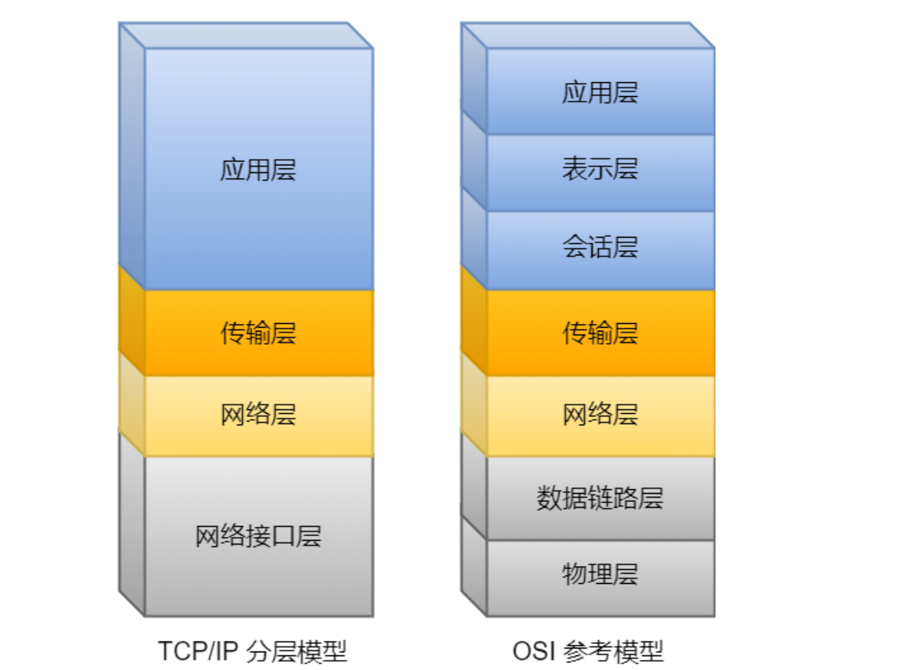
  
- 什么是Tcp连接：用于保证可靠性和流量控制维护的某些状态信息，这些信息的组合，包括Socket、序列号和窗口大小称为连接。
  1. Socket：由IP地址和端口号组成。
  2. 序列号：用来解决乱序问题等。
  3. 窗口大小：用来做流量控制。

- TCP四元组可以唯一确定一个连接。

- UDP头部格式

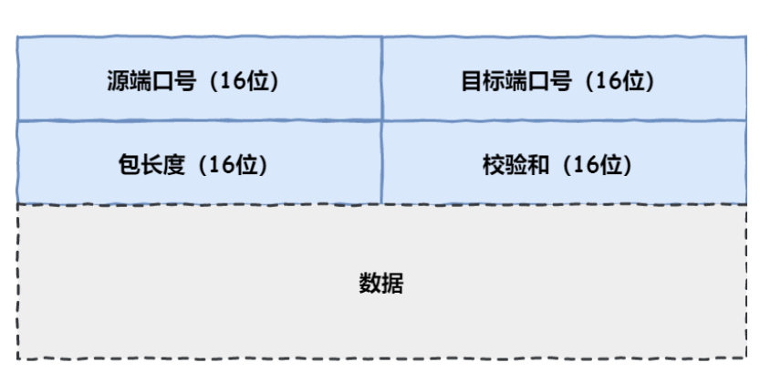

相比与TCP的头部格式，UDP比较简单，头部只有固定的8个字节（无需首部长度）。

1.目标和源端口：主要是告诉 UDP 协议应该把报文发给哪个进程。

2.包长度：该字段保存了 UDP 首部的长度跟数据的长度之和。

3.校验和：校验和是为了提供可靠的 UDP 首部和数据而设计。

- 数据分片上的区别

  TCP 的数据大小如果大于 MSS 大小，则会在传输层进行分片，目标主机收到后，也同样在传输层组装 TCP 数据包，如果中途丢失了一个分片，只需要传输丢失的这个分片。

  UDP 的数据大小如果大于 MTU 大小，则会在 IP 层进行分片，目标主机收到后，在 IP 层组装完数据，接着再传给传输层，但是如果中途丢了一个分片，在实现可靠传输的 UDP 时则就需要重传所有的数据包，这样传输效率非常差，所以通常 UDP 的报文应该小于 MTU

- TCP连接建立：通过**三次握手**来完成连接

  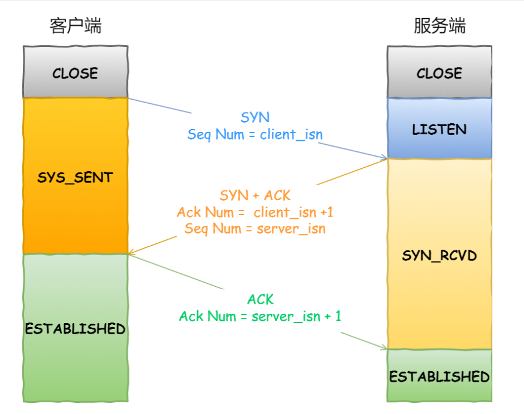

​	一开始，客户端和服务端都处于 CLOSED 状态。先是服务端主动监听某个端口，处于 LISTEN 状态。

​	客户端把第一个 SYN 报文发送给服务端，表示向服务端发起连接，该报文不包含应用层数据，之后客户端处于 SYN-SENT 状态。

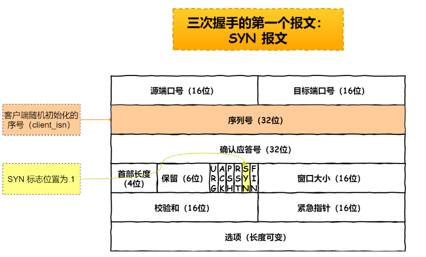

​	服务端收到客户端的 SYN 报文后，首先服务端也随机初始化自己的序号（server_isn），将此序号填入 TCP 首部的「序列号」字段中，其次把 TCP 首部的「确认应答号」字段填入client_isn + 1, 接着把 SYN 和 ACK 标志位置为 1。最后把该报文发给客户端，该报文也不包含应用层数据，之后服务端处于 SYN-RCVD 状态。

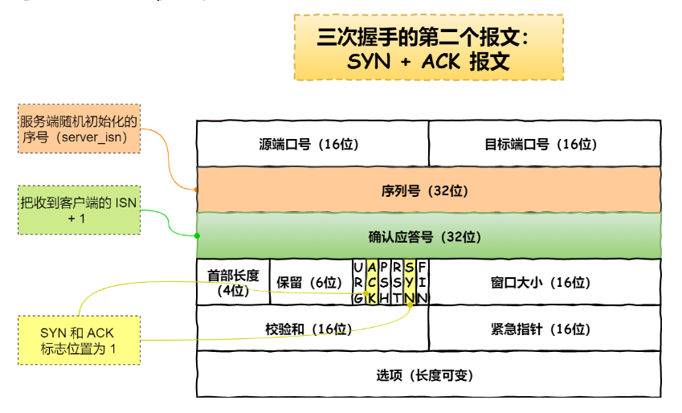

​	客户端收到服务端报文后，还要向服务端回应最后一个应答报文，首先该应答报文 TCP 首部 ACK 标志位置为 1 ，其次「确认应答号」字段填入 server_isn + 1 ，最后把报文发送给服务端，这次报文可以携带客户到服务器的数据，之后客户端处于 ESTABLISHED 状态。服务器收到客户端的应答报文后，也进入 ESTABLISHED 状态。

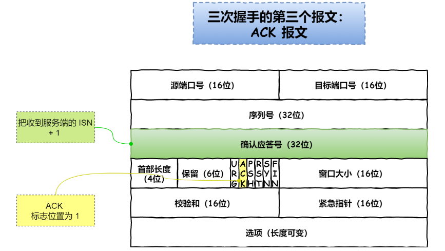

**重点：第三次握手是可以携带数据的，前两次握手是不可以携带数据的。**

- 三次握手的原因（三个方面）：
  1. 三次握手才可以阻止重复历史连接的初始化（主要原因）
  2. 三次握手才可以同步双方的初始序列号
  3. 三次握手才可以避免资源浪费

1.避免历史连接

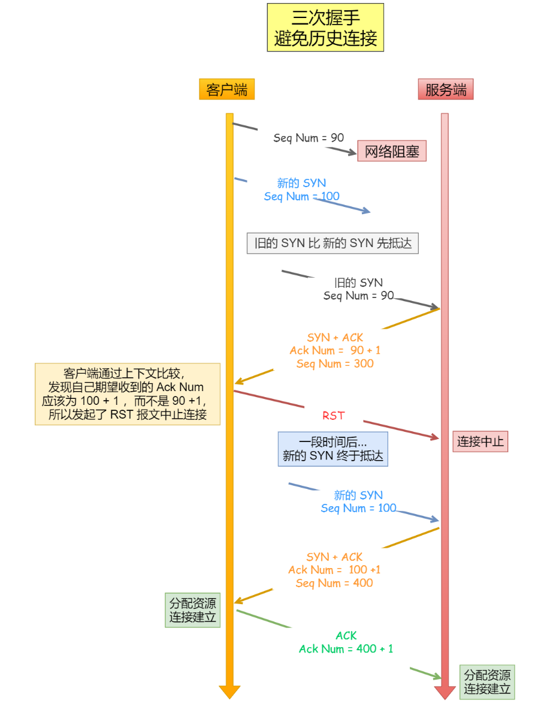

​	如果是两次握手连接，就不能判断当前连接是否是历史连接，三次握手则可以在客户端（发送方）准备发送第三次报文时，客户端因有足够的上下文来判断当前连接是否是历史连接：

​	1.如果是历史连接（序列号过期或超时），则第三次握手发送的报文是 RST 报文，以此中止历史连接。

​	2.如果不是历史连接，则第三次发送的报文是 ACK 报文，通信双方就会成功建立连接。

2.同步双方初始序列号

- 序列号的作用：1.接收方可以去除重复的数据。2.接收方可以根据数据包的序列号按序接收。

  两次握手只保证了一方的初始序列号能被对方成功接收，没办法保证双方的初始序列号都能被确认接收。

3.避免资源浪费

​	如果只有「两次握手」，客户端的 SYN 阻塞了，重复发送多次 SYN 报文，那么服务器在收到请求后就会建立多个冗余的无效链接，造成不必要的资源浪费。

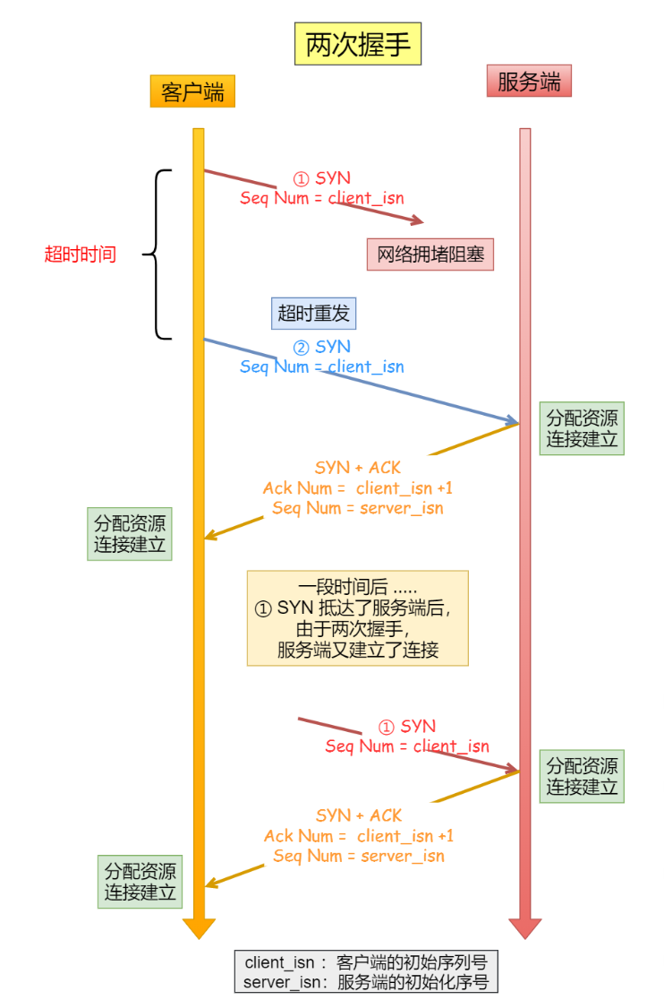

- 每次建立连接前重新初始化一个序列号主要是为了通信双方能够根据序号将不属于本连接的报文段丢弃。

- MTU和MSS

  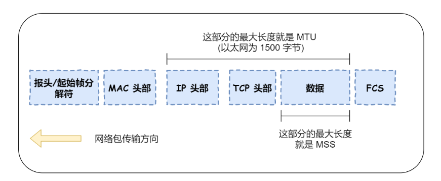

- MTU：一个网络包的最大长度，以太网中一般为 1500 字节。
- MSS：除去 IP 和 TCP 头部之后，一个网络包所能容纳的 TCP 数据的最大长度。

- 问：既然 IP 层会分片（MTU），为什么 TCP 层还需要 MSS 呢？

  答：当 IP 层有一个超过 MTU 大小的数据要发送，那么 IP 层就要进行分片，那么如果当一个 IP 分片丢失，整个 IP 报文的所有分片都得重传。由 IP 层进行分片传输，是非常没有效率的。

  MSS：为了达到最佳的传输效能 TCP 协议在建立连接的时候通常要协商双方的 MSS 值，当 TCP 层发现数据超过 MSS 时，则就先会进行分片，当然由它形成的 IP 包的长度也就不会大于 MTU ，自然也就不用 IP 分片了

- TCP连接断开：通过**四次挥手**完成。

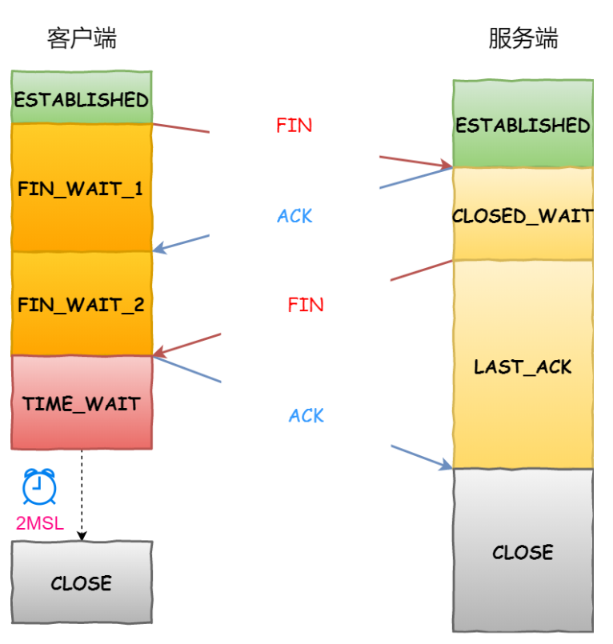

- 过程：

1.客户端打算关闭连接时，会发送一个 TCP 首部 FIN 标志位被置为 1 的报文（即 FIN 报文），之后客户端进入FIN_WAIT_1 状态。

2.服务端收到该报文后，就向客户端发送 ACK 应答报文，接着服务端进入 CLOSED_WAIT 状态。

3.客户端收到服务端的 ACK 应答报文后，之后进入 FIN_WAIT_2状态。

4.等待服务端处理完数据后，也向客户端发送 FIN 报文，之后服务端进入 LAST_ACK 状态。

5.客户端收到服务端的 FIN 报文后，回一个 ACK 应答报文，之后进入 TIME_WAIT 状态服务器收到了 ACK 应答报文后，就进入了 CLOSED 状态，至此服务端已经完成连接的关闭。

6.客户端在经过 2MSL 一段时间后，自动进入 CLOSED 状态，至此客户端也完成连接的关闭。

- 为什么需要四次挥手？

  答：在服务器收到客户端的FIN报文时，只会先回一个ACK应答报文，并不会附加上FIN，因为服务端可能还有数据需要处理和发送（客户端发送FIN报文，仅表示客户端不再发送数据，但仍可以接收数据）

- MSL指的是报文最大生存时间，只有主动发起关闭连接的一方，才会有TIME-WAIT时间。

- 需要TIME-WAIT状态的原因：

  1. 防止具有相同**四元组**的**旧**的数据包被接收到。

     解释：经过2MSL的时间，足以让两个方向的数据报都被丢弃，使原来连接的数据报在网络中消失。

  2. 保证被动关闭连接的一方能被正确的关闭。

​				解释：服务端若没有收到四次挥手的最后一个ACK报文，就会重发FIN报文，并等待新的ACK报文。

- Socket编程

  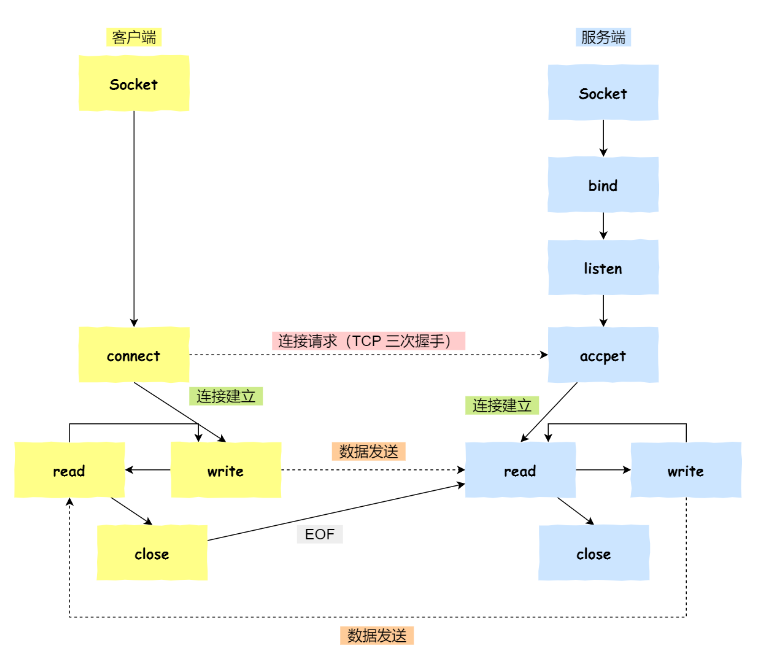

1.服务端和客户端初始化 socket，得到文件描述符；

2.服务端调用 bind，将绑定在 IP 地址和端口;

3.服务端调用 listen，进行监听；

4.服务端调用 accept，等待客户端连接；

5.客户端调用 connect，向服务器端的地址和端口发起连接请求；

6.服务端 accept 返回用于传输的 socket 的文件描述符；

7.客户端调用 write 写入数据；服务端调用 read 读取数据；

8.客户端断开连接时，会调用 close，那么服务端 read 读取数据的时候，就会读取到了 EOF，待处理完数据后，服务端调用close，表示连接关闭。

注：服务端调用 accept 时，连接成功了会返回一个已完成连接的 socket，后续用来传输数据。所以，监听的 socket 和真正用来传送数据的 socket是**两个** socket，一个叫作**监听 socket**，一个叫作**已完成连接 socket**。

9.成功连接建立之后，双方开始通过 read 和 write 函数来读写数据。

- Linux内核会维护两个队列：
  1.未完成连接队列（SYN队列）：接受一个SYN建立连接请求，处于SYN_RCVD状态。

  2.已完成连接队列（Accept队列）：已完成TCP三次握手过程，处于ESTABLISHED状态。

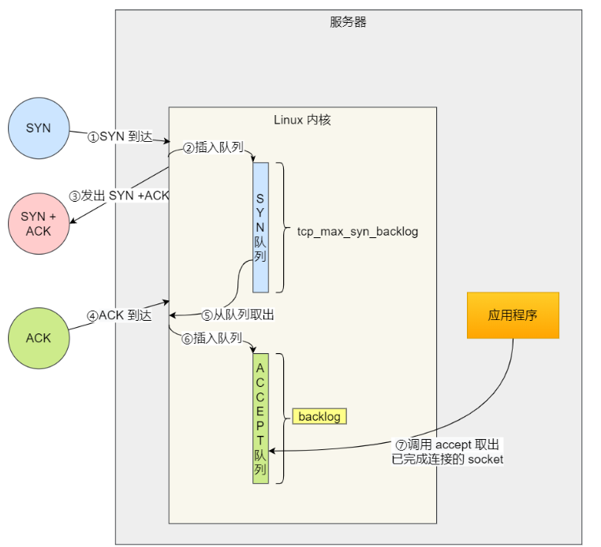
~~~C++
int listen(int socketfd,int backlog);
//socketfd为socket文件描述符
//backlog为accept队列的长度
~~~

- 客户端连接服务器

  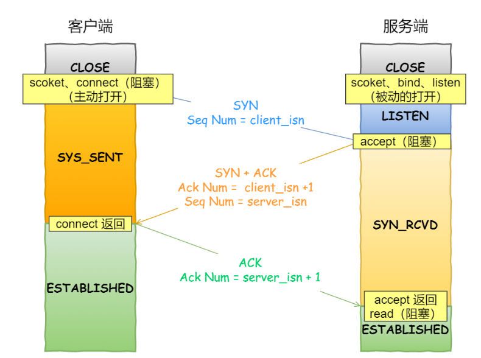

- 客户端connect成功返回是在第二次握手，服务端accept成功返回是在三次握手成功之后。

- 客户端断开服务器

  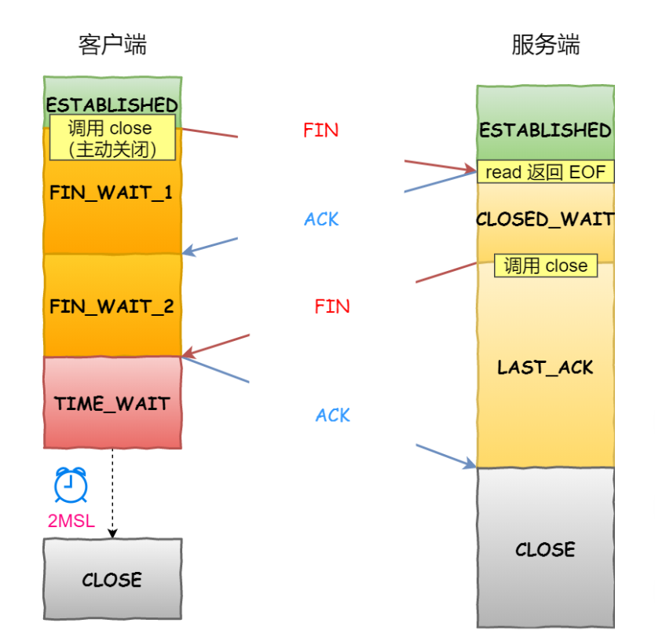

- TCP协议栈会为服务端接受到的FIN包插入一个文件结束符EOF到接收缓冲区，应用程序可以通过read调用来感知这个FIN包。