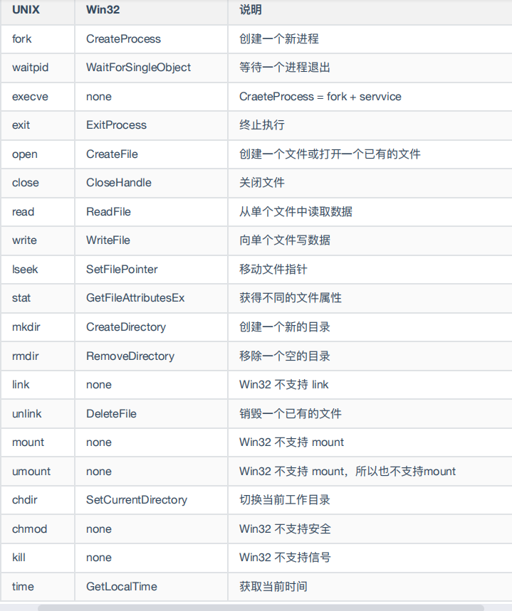

# 操作系统

## 1.系统调用

1. 用于进程管理的系统调用

   **fork**创建一个原有进程的副本，包括所有的文件描述符，寄存器等内容。**fork**调用会返回一个值，在子进程中为0，在父进程中为子进程的PID。

   **execve**系统调用可以实现系统执行。它有三个参数，将要执行的文件名称，一个指向变量数组的指针，一个指向环境数组的指针。

   ~~~c
   execve(command,parameters,0)
   ~~~

2. 用于文件管理的系统调用。

   **read**和**write**系统调用用于文件的读写。

   **iseek**系统调用可以改变指向文件当前位置指针的值，这样后续的read和write调用就可以在文件的任何地方开始。
   
   ~~~c
   position =iseek(fd,offset,whence)
   ~~~

3. 用于目录管理的系统调用。

   **mkdir**和**rmdir**分别用于创建和删除**空目录**，**link**系统调用作用是允许同一个文件以两个或多个名称出现。

~~~c
s=mkdir(nname,mode);
s=rmdir(name);
s=link(name1,name2);
~~~

mount系统调用会将两个文件系统合并为一个。例：通过执行mount系统调用，USB文件系统可以被添加到根文件系统中。

~~~c
s=mount(special,name,flag);
~~~

**Win 32 API**

- Window和UNIX在各自的编程方式上有着根本的不同。
  - UNIX程序有由执行某些操作或执行其他操作的代码组成，执行系统调用以执行某些服务。
  - Window应用程序通常是由事件驱动的。

## 2.进程和线程

1. 进程

   概念：进程是对正在运行中的程序的一个抽象。

   伪并行:伪并行是指单核或多核处理器同时执行多个进程。通过以非常有限的时间间隔在程序之间快速切换CPU，因此产生并行感。缺点是CPU时间可能分配给下一个进程，也可能不分配给下一个进程。

​    2.进程模型

​		一个进程就是一个正在执行的程序的实例，进程也包括程序计数器，寄存器，和变量的当前值。

​	3.进程的创建

- 创建进程的方式：

  1. 系统初始化（init）。
  
  2. 正在运行的程序执行了创建进程的系统调用。
  
  3. 用户请求创建了一个新进程。
  
  4. 初始化一个批处理工作。
  
     
  
  1. 系统初始化
  
     操作系统启动时，会创建若干进程。例如前台进程：同用户进行交互并替他们完成工作的进程。
  
     守护进程：运行在后台，并不与特定用户进行交互。
  
  2. 系统调用创建
  
     一个正在运行的程序发出系统调用来创建一个或多个新进程来协助其完成工作。例如fork（）
  
  3. 用户请求创建
  
     在交互式系统中，输入一个命令或双击图标就可以启动程序。
  
  4. 批处理创建

- 在UNIX中仅有一个系统调用用来创建一个新的进程，也就是**fork**。在fork之后，一个父进程和子进程会有相同的内存映像，相同的环境字符和相同的打开文件。通常，子进程会执行exexve或一个简单的系统调用来改变内存映像，从而运行一个新的程序。

- UNIX操作系统和Windows操作系统 系统调用的对比

  

对比：

- 在UNIX中，不可写的内存区域是父子进程共享的，可写的内存是不共享的（或通过写时复制）。

- 在Windows中，从一开始父进程的地址空间和子进程的地址空间就是不同的。

  

4.进程的终止

- 正常退出（自愿）
- 错误退出（自愿）
- 严重错误（非自愿）
- 被其他进程杀死（非自愿）

  

